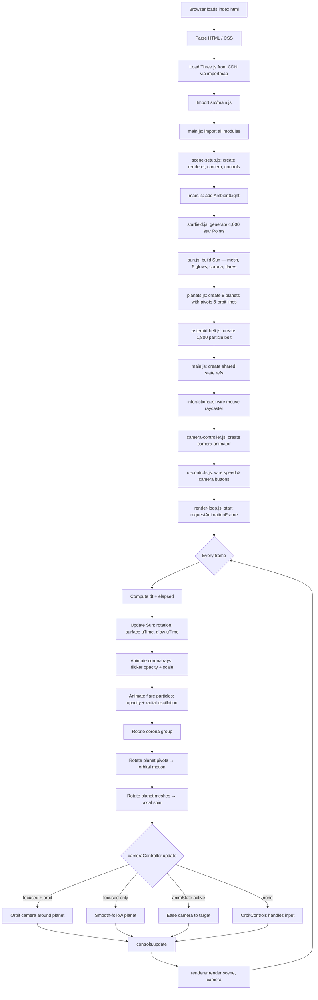
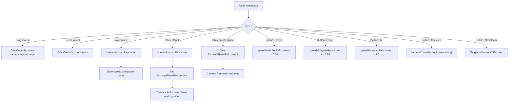
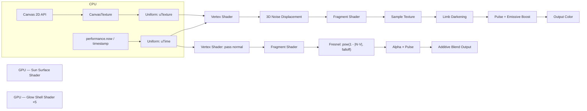
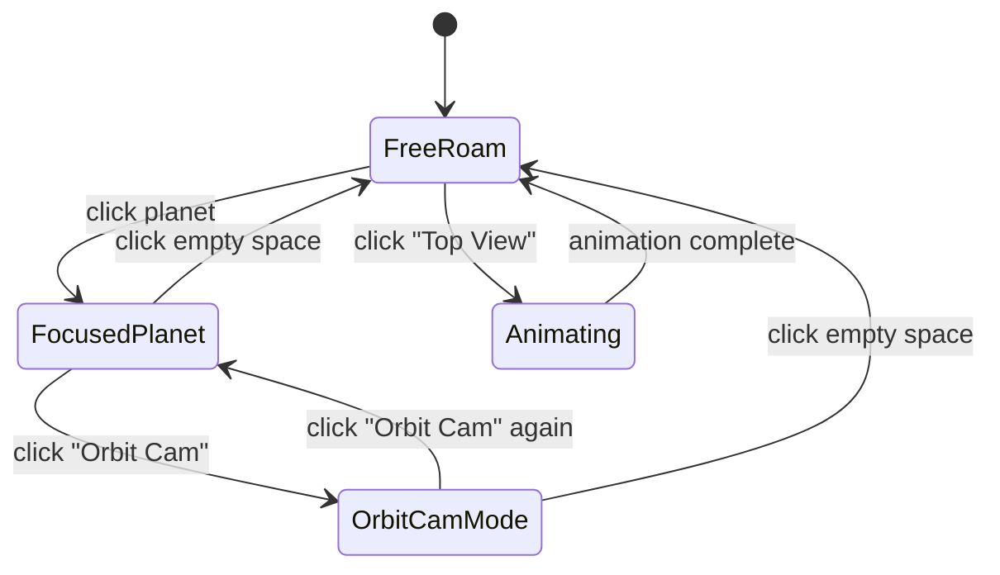

# Flowchart

## Application Lifecycle

```mermaid
flowchart TD
    A[Browser loads index.html] --> B[Parse HTML / CSS]
    B --> C[Load Three.js from CDN via importmap]
    C --> D[Import src/main.js]
    D --> E[main.js: import all modules]

    E --> F[scene-setup.js: create renderer, camera, controls]
    F --> G[main.js: add AmbientLight]
    G --> H[starfield.js: generate 4,000 star Points]
    H --> I[sun.js: build Sun — mesh, 5 glows, corona, flares]
    I --> J[planets.js: create 8 planets with pivots & orbit lines]
    J --> K[asteroid-belt.js: create 1,800 particle belt]

    K --> L[main.js: create shared state refs]
    L --> M[interactions.js: wire mouse raycaster]
    M --> N[camera-controller.js: create camera animator]
    N --> O[ui-controls.js: wire speed & camera buttons]
    O --> P[render-loop.js: start requestAnimationFrame]

    P --> Q{Every frame}
    Q --> R[Compute dt + elapsed]
    R --> S[Update Sun: rotation, surface uTime, glow uTime]
    S --> T[Animate corona rays: flicker opacity + scale]
    T --> U[Animate flare particles: opacity + radial oscillation]
    U --> V[Rotate corona group]
    V --> W[Rotate planet pivots → orbital motion]
    W --> X[Rotate planet meshes → axial spin]

    X --> Y{cameraController.update}
    Y -->|focused + orbit| Z[Orbit camera around planet]
    Y -->|focused only| AA[Smooth-follow planet]
    Y -->|animState active| AB[Ease camera to target]
    Y -->|none| AC[OrbitControls handles input]

    Z --> AD[controls.update]
    AA --> AD
    AB --> AD
    AC --> AD
    AD --> AE[renderer.render scene, camera]
    AE --> Q
```

## Module Initialization Order (main.js)

```mermaid
flowchart LR
    A["1. createScene()"] --> B["2. AmbientLight"]
    B --> C["3. createStarfield()"]
    C --> D["4. createSun()"]
    D --> E["5. createPlanets()"]
    E --> F["6. createAsteroidBelt()"]
    F --> G["7. Shared state refs"]
    G --> H["8. setupInteractions()"]
    H --> I["9. createCameraController()"]
    I --> J["10. setupUIControls()"]
    J --> K["11. startRenderLoop()"]

    style A fill:#049ef4,stroke:#333,color:#fff
    style K fill:#43a047,stroke:#333,color:#fff
```

## User Interaction Flow

```mermaid
flowchart TD
    A[User Interaction] --> B{Type?}

    B -->|Drag mouse| C[OrbitControls: rotate camera around target]
    B -->|Scroll wheel| D[OrbitControls: zoom in/out]
    B -->|Hover planet| E[interactions.js: Raycaster]
    E --> F[Show tooltip with planet name]
    B -->|Click planet| G[interactions.js: Raycaster]
    G --> H["Set focusedPlanetRef.current"]
    H --> I[Camera locks onto planet world position]
    B -->|Click empty space| J["Clear focusedPlanetRef.current"]
    J --> K[Camera free-roam resumes]

    B -->|Button: Slower| L["speedMultiplierRef.current -= 0.25"]
    B -->|Button: Faster| M["speedMultiplierRef.current += 0.25"]
    B -->|Button: 1×| N["speedMultiplierRef.current = 1.0"]
    B -->|Button: Top View| O["cameraController.beginAnimation()"]
    B -->|Button: Orbit Cam| P[Toggle orbit-cam CSS class]
```

## Shader Pipeline

```mermaid
flowchart LR
    subgraph CPU
        A[Canvas 2D API] --> B[CanvasTexture]
        B --> C["Uniform: uTexture"]
        D["performance.now / timestamp"] --> E["Uniform: uTime"]
    end

    subGPU[GPU — Sun Surface Shader]
        C --> F[Vertex Shader]
        E --> F
        F --> G[3D Noise Displacement]
        G --> H[Fragment Shader]
        H --> I[Sample Texture]
        I --> J[Limb Darkening]
        J --> K[Pulse + Emissive Boost]
        K --> L[Output Color]

    subGPU2[GPU — Glow Shell Shader ×5]
        E --> M[Vertex Shader: pass normal]
        M --> N[Fragment Shader]
        N --> O["Fresnel: pow(1 - |N·V|, falloff)"]
        O --> P[Alpha × Pulse]
        P --> Q[Additive Blend Output]
```

## State Machine — Camera

```mermaid
stateDiagram-v2
    [*] --> FreeRoam
    FreeRoam --> FocusedPlanet: click planet
    FreeRoam --> Animating: click "Top View"
    FocusedPlanet --> OrbitCamMode: click "Orbit Cam"
    FocusedPlanet --> FreeRoam: click empty space
    OrbitCamMode --> FocusedPlanet: click "Orbit Cam" again
    OrbitCamMode --> FreeRoam: click empty space
    Animating --> FreeRoam: animation complete
```
